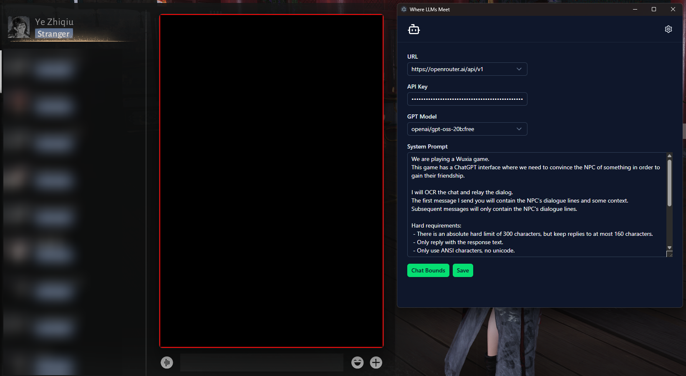

# Quick Start

## Before we Start

You may want to run the app as administrator.

For some reason, the screenshot to OCR functionality may not work properly after the first screenshot.
This results in the app only OCR'ing the first screenshot taken.

I am not too sure of the cause, I suspect the fact that Where Winds Meet sometimes runs as administrator, and that causes the app to not be able to see the game properly.

You can still try running the app without administrator, it has worked sometimes for me.

## Getting the LLM ready

1. Open the app and press the gear icon on the top right corner
2. You need an LLM provider and API key, I recommend using OpenRouter or local Ollama. This guide continues with OpenRouter.
3. Signup to https://openrouter.ai/ and obtain an API key: https://openrouter.ai/settings/keys .
4. OpenRouter provides some free LLM models (a default one has been picked for you). These free models come with a rate limit of 50 chats/day. This limit can be increased to 1000 chats/day if you purchase 10USD worth of OpenRouter credits.
5. Check OpenRouter's documentation for the most up-to-date information about their policies.
6. Paste the API key into the app. Click "Save".

## Tell the app where to scan for the chat messages

1. Click "Chat Bounds", a black box with a red border should pop-up.
2. Move the box over the chat area, make it as similar to the image below as possible.
3. Click "Save". The app is ready for use now, press the gear icon to return to the main screen.

