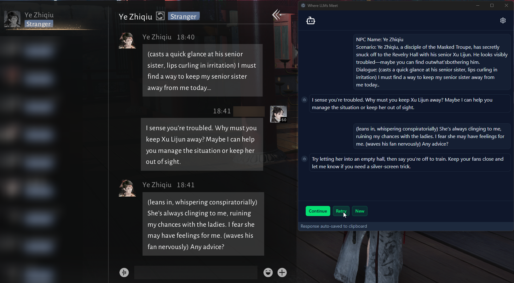
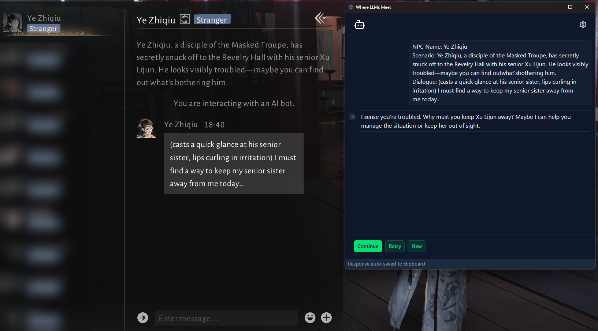
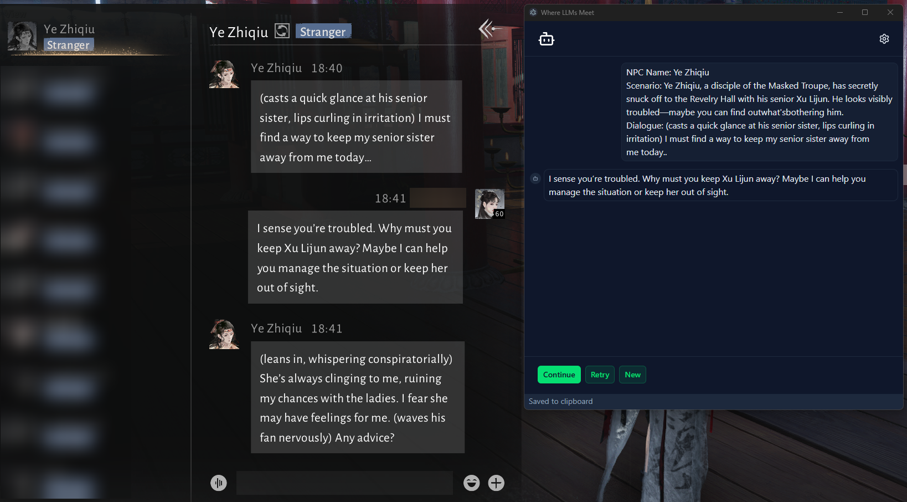

# Usage

This is a step-by-step guide on how to operate the app.

1. Start chatting with the AI NPC. Ensure that the chat screen is completely fresh. If there are previous attempts, clear the chat and restart the conversation as shown in the below pic.

2. Click on "New" to start scanning the chat with the app. The app will OCR the chat and send the text over to the LLM. The LLM response will be auto-saved to the clipboard when it is done processing.

3. Paste the response into the game window and send it. Wait for the NPC to reply. Now you may click "continue". Repeat this process until the NPC is happy with you.

## Retrying conversations

Occasionally, the OCR or LLM may mess up and some of the data may be garbled. In such cases, you probably want to retry. Click on the retry button to retry the previous operation.
